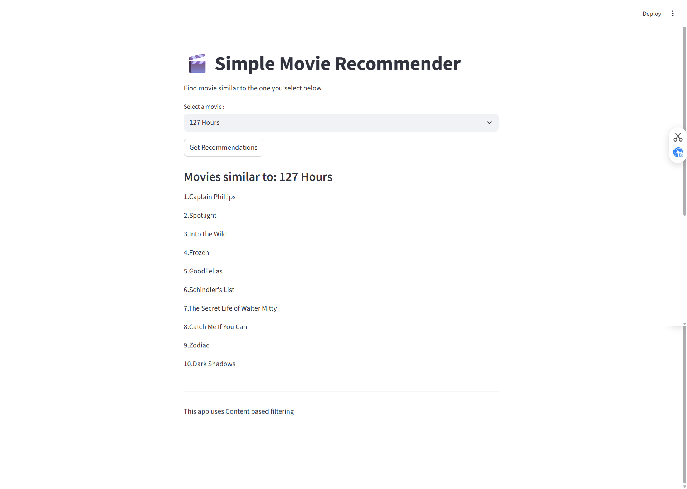

## Implemented a Movie Recommender System, which will recommend the top 10 movies similar to the movie the user has selected. The focus was to understand the Data Science Lifecycle (from data collection to model deployment). Furthermore, using streamlit package created a simple UI which describe how the ML algorithms are integrated with a web application to perform prediction.

**
Movie Recommender UI
**

 

**Steps**

1. Clone this github repository
2. Install the required packages using pip  
`pip install -r requirements.txt`
3. The dataframes and models is already saved in directory *dumped_obj*. The code for this is in Jupyter notebook named *Movie_Recommendation_System.ipynb*.

    - Option 1 : You can re-execute the notebook file and it will save the dataframes and models again in the dumped_obj directory

    - Option 2 : Continue with saved model and run the python script written in *model_deployment.py* file from terminal:  
    `streamlit run model_deployment.py` 
    This command will run streamlit localhost engine and you will be navigated to Simple UI in default browser.

> [!Note]
> Before executing the Jupyter Notebook and streamlit command, please make sure that your terminal is pointing to current working directory.

## Dataset Information

The project utilizes two primary datasets containing comprehensive movie information.

---

### 1. credits.csv
This dataset contains information regarding the cast and crew of the movies.

| Feature | Description |
| :--- | :--- |
| **movie_id** | A unique identifier for each movie. |
| **cast** | The names of lead and supporting actors. |
| **crew** | The names of the Director, Editor, Composer, Writer, etc. |

---

### 2. movies.csv
This dataset contains metadata and performance metrics for the movies.

| Feature | Description |
| :--- | :--- |
| **budget** | The budget in which the movie was made. |
| **genre** | The genre of the movie (Action, Comedy, Thriller, etc.). |
| **homepage** | A link to the homepage of the movie. |
| **id** | The unique identifier (matches `movie_id` in the credits dataset). |
| **keywords** | Keywords or tags related to the movie. |
| **original_language** | The language in which the movie was made. |
| **original_title** | The title of the movie before translation or adaptation. |
| **overview** | A brief description of the movie. |
| **popularity** | A numeric quantity specifying the movie's popularity. |
| **production_companies** | The production house of the movie. |
| **production_countries** | The country in which it was produced. |
| **release_date** | The date on which it was released. |
| **revenue** | The worldwide revenue generated by the movie. |
| **runtime** | The running time of the movie in minutes. |
| **status** | "Released" or "Rumored". |
| **tagline** | The movie's tagline. |
| **title** | The title of the movie. |
| **vote_average** | Average ratings the movie received. |
| **vote_count** | The count of votes received. |

Thank you and have a nice day :smile:

